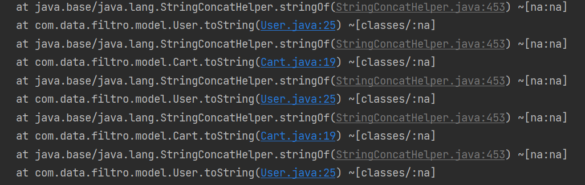
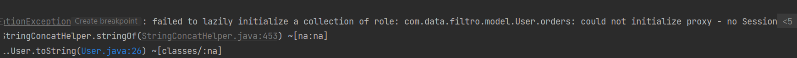

# Vòng lặp vô hạn 

- Lỗi này thường xảy ra khi có một vòng lặp vô hạn trong phương thức toString() của các lớp User và Cart. Điều này có thể xảy ra nếu các lớp này tham chiếu lẫn nhau, dẫn đến việc gọi phương thức toString() liên tục mà không dừng lại.

- Nếu sử dụng @ToString(exclude) thì phải cố gắng loại bỏ hết toàn bộ các @OneToMany. Vì theo giải thích thì @ToString can thiệp vào việc load lazy dữ liệu từ DB, làm tắt session khiến không load lazy được.

======================================================================================================================================================================================
Caused by: org.springframework.beans.factory.UnsatisfiedDependencyException: Error creating bean with name 'jwtFilter' defined in file [D:\springboot\workspace\FourLeavesShoes\DoAnXinViec_fourleavesshoes\target\classes\com\data\filtro\config\JwtFilter.class]: Unsatisfied dependency expressed through constructor parameter 0: Error creating bean with name 'applicationConfig' defined in file [D:\springboot\workspace\FourLeavesShoes\DoAnXinViec_fourleavesshoes\target\classes\com\data\filtro\config\ApplicationConfig.class]: Unsatisfied dependency expressed through constructor parameter 0: Error creating bean with name 'userService': Unsatisfied dependency expressed through field 'cartService': Error creating bean with name 'cartService': Unsatisfied dependency expressed through field 'productService': Error creating bean with name 'productService': Injection of autowired dependencies failed
...
Caused by: org.springframework.beans.factory.BeanCreationException: Error creating bean with name 'productService': Injection of autowired dependencies failed
Caused by: java.lang.IllegalArgumentException: Could not resolve placeholder 'spring.data.minio.bucketName' in value "${spring.data.minio.bucketName}"

=> UnsatisfiedDependencyException là một lỗi dây chuyền Bean. có nghĩa là trong một dây chuyền gọi Bean A->B->C->D->E->F->G mà chỉ cần một bean bị lỗi thì từ đầu dây chuyền tới bean bị lỗi sẽ bị lỗi tạo bean. kéo stack trace xuống sẽ lấy bean nào bị lỗi

======================================================================================================================================================================================
