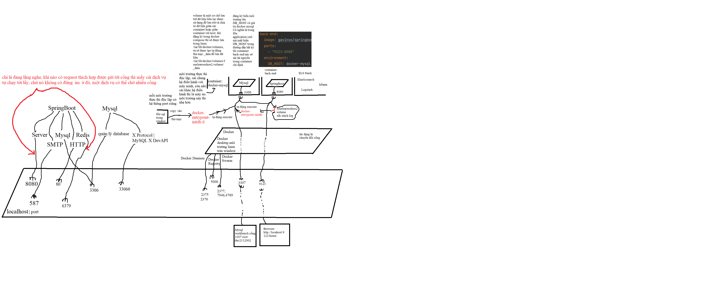
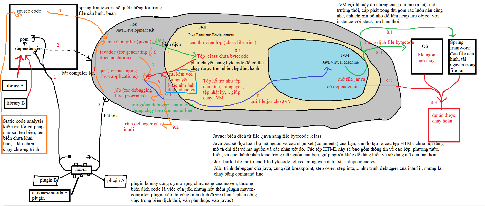
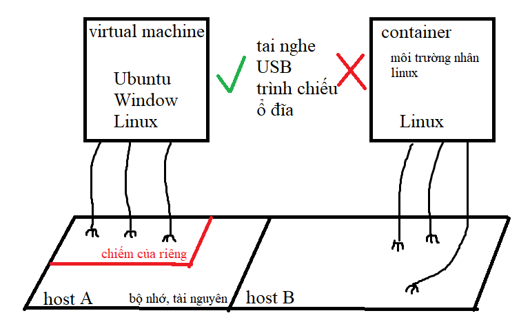
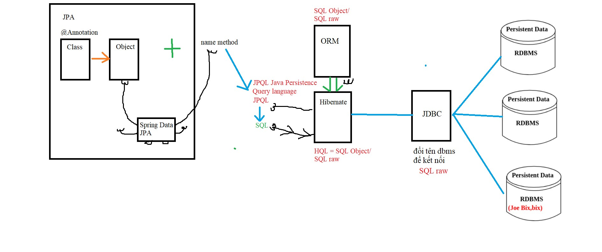

# Detailed explanations about Docker, Docker Compose files, and YAML.
According to the annotated diagram, Docker can be understood as a tool to run applications and software on independent Linux environments. Each application will run on a lightweight Linux environment (these are simplified versions of Linux that consume fewer resources).

When we install Docker Desktop, the following components are installed:

- Docker Engine: This is the core component of Docker, allowing you to create and manage containers.
- Docker CLI: A command-line tool to interact with Docker Engine.
- Docker Compose: A tool to define and run multi-container Docker applications.
- Docker Desktop GUI: A graphical interface that makes it easy to manage containers and images.
- Hyper-V or WSL 2: Docker Desktop uses one of these technologies to run Docker Engine on Windows. Hyper-V is a virtualization technology from Microsoft, while WSL 2 (Windows Subsystem for Linux 2) allows running a real Linux kernel on Windows.

An Image can be understood as source code, or source code along with a set of tools and a virtual machine packaged together. When you put an image into a Linux environment in Docker and run this image, that environment will become a container.

Volume: A mechanism to store data outside the container, ensuring data is not lost when the container is deleted or restarted. Volumes can be mounted to specific directories in the container.

When considering between containers, since they are Linux environments, they have the same directory structure. So when we mount a volume to a directory on one container, and then mount that volume to a similar directory on another container, we have access to the files in that directory from the container that was mounted with the volume previously.

Example:

- Container A mounts volume `/data` to the directory `/app/data`.
- Container B also mounts volume `/data` to the directory `/app/data`.
- As a result, both containers can read and write data to the directory `/app/data` and share data with each other.


# CI file
```ruby
name: Java CI with Maven 
// This sets the name of the workflow, which will appear in the GitHub Actions tab.
 
on:
  push:
    branches: [ "main" ]
  pull_request:
    branches: [ "main" ]
// Specifies the events that trigger the workflow. Here, the workflow runs on push and pull_request events to the main branch.


jobs:
  build-deploy:
    name: Build and Deploy Spring Boot
    // jobs: Defines a list of jobs to run. Each job runs in a fresh instance of the virtual environment.
    // build-deploy: The ID of the job.
    // name: A human-readable name for the job.
    
    services:
      mysql:
        image: mysql:8.0
        ports:
          - 3306:3306
        // the left side port is in host, the other one is inside container.
        
        env:
            MYSQL_ROOT_PASSWORD: duc2112002
            MYSQL_DATABASE: fourleavesshoe2
        options: --health-cmd="mysqladmin ping" --health-interval=10s --health-timeout=5s --health-retries=3
      // services: Defines services that are required for the job. Here, a MySQL service is set up.
      // mysql: The ID of the service.
      // image: The Docker image to use for the service.
      // ports: Maps the container port to the host port.
      // env: Environment variables for the MySQL container.
      // options: Additional options for the service, such as health checks.
    
    runs-on: ubuntu-latest
    // runs-on: Specifies the type of runner (virtual machine) to use. Here, it uses the latest Ubuntu runner
    
    steps:
    // steps: A list of steps to run in the job.
    
    - name: Checkout code
      uses: actions/checkout@v3
    // name: A human-readable name for the step.
    // uses: Specifies an action to use. Here, it uses the actions/checkout action to check out the repository code.
    
    - name: Set up JDK 17
      uses: actions/setup-java@v3
      with:
        java-version: '17'
        distribution: 'temurin'
        cache: maven
        
    // Set up JDK 17: Sets up JDK 17 using the actions/setup-java action.
    // with: Specifies parameters for the action.
        // java-version: The version of Java to use.
        // distribution: The distribution of JDK to use (Temurin in this case).
        // cache: Enables caching for Maven dependencies.

        // actions/checkout: This is a GitHub Action used to checkout (retrieve the source code) of the repository into the working directory of the GitHub Actions runner. This allows other workflows to access and work with your source code.
        // actions/setup-java: This is a GitHub Action used to install and configure a specific version of Java on the GitHub Actions runner. It supports multiple versions and distributions of Java.
        // Java distributions are different versions of the Java Development Kit (JDK) provided by various vendors: các bản phân phối java
        
    - name: Test with Maven
      run: mvn -B test --file pom.xml
      // Test with Maven: Runs Maven tests, a name of job's step
      // Runs the Maven command mvn -B test --file pom.xml to execute the tests defined in the pom.xml file.
      
    - name: Build with Maven
      run: |
        mvn clean install
        mvn -B package --file pom.xml
        // run the maven command
        // clean: This command deletes the target directory 
        // install: This phase compiles the code, runs tests, and installs the resulting artifact (usually a JAR file) into the local Maven repository. 
        // However, the original artifact JAR just have the basic information without compiled code.
        // package:  This phase takes the compiled code and packages it into a distributable format, such as a JAR or WAR file.
        // maven downloaded dependency into maven local storage. 
        // When you run Maven commands in the YAML file of a GitHub workflow, the dependencies will be downloaded and stored in the ~/.m2/repository directory of the runner. 
        // Then, when you package your application into a Docker image, these dependencies will be included in the image. Runner is a host or an environment where executes workflows.
        // Github provides runners to execute workflows in Github Actions.
        
    - name: Login to DockerHub
      uses: docker/login-action@v3
      with:
        username: ${{ secrets.DOCKER_USERNAME }}
        password: ${{ secrets.DOCKER_PASSWORD }}

    - name: Build Docker Image
      uses: docker/build-push-action@v3
      with:
            context: .
            dockerfile: Dockerfile
            push: false
            tags: gavinvo/springboot_filtro:latest
      # This is an action named build-push-action at version 3. This action is used to build and optionally push the Docker image to a registry such as Docker Hub.
      # The runner will use the Dockerfile from the source code, which is obtained from the checkout@v3 action, to build the Docker image.
      # The JAR file is copied into the image, and the image is tagged as "gavinvo/springboot_filtro:latest".
      # Since 'push' is set to false, the image will not be pushed to a Docker registry.


    - name: Push Docker Image
      uses: docker/build-push-action@v3
      with:
            context: .
            dockerfile: Dockerfile
            push: true
            tags: gavinvo/springboot_filtro:latest


```
# Docker file
```ruby
FROM eclipse-temurin:17-jdk-alpine
// The runner will use the Eclipse Temurin JDK 17 to run the JAR file.

WORKDIR /app
// This sets the working directory inside the container to /app. Any subsequent commands will be run from this directory /ˈsʌbsɪkwənt/ các lệnh tiếp theo 

COPY target/filtro-0.0.1-SNAPSHOT.jar /app/fourleavesshoedocker.jar
// After building and running the Spring project, the JAR file is located in the target directory. When the job in the GitHub Actions workflow is executed, the checkout@v3 action will retrieve the source code from the repository. /rɪˈpɑːzətɔːri/ 
// This command will then copy the JAR file from the source code to the GitHub runner’s /app directory

EXPOSE 8080
// This informs Docker that the container will listen on port 8080 at runtime. It doesn’t actually publish the port; it just serves as documentation and a hint for users of the image.

CMD ["java","-jar","/app/fourleavesshoedocker.jar"]
// This specifies the command to run when the container starts. It runs the JAR file using the java -jar command. /kəˈmænd/
// When you build and push an image to Docker Hub, the CMD command in your Dockerfile doesn’t execute during the build or push process. 
// It only runs when you start a container from that image.
```

# docker-compose.yml
```ruby
version: '3.7'
// This specifies the version of the Docker Compose file format you’re using.

services:
  docker-mysql:
    image: mysql:8.0
    restart: always
    // Always restart the container if it stops unexpectedly, such as Network Issues
    
    environment:
    // Sets environment variables for the MySQL container
      MYSQL_DATABASE: fourleavesshoe2
      MYSQL_ROOT_PASSWORD: duc2112002
      
    healthcheck:
      test: [ "CMD", "mysqladmin" ,"ping", "-h", "localhost" ]
      timeout: 20s
      retries: 10
      // Checks the health of the MySQL service by pinging it. If it fails, it retries up to 10 times with a 20-second timeout.: thời gian chờ 20s
      
    ports:
      - "3307:3306"
      // Maps port 3307 on the host to port 3306 in the container.
      
    volumes:
      - fourleavesshoe2-volume:/var/lib/mysql
      // This volume is used to store updated data when the image is run. When the container starts, this data (queries) will be automatically executed in the MySQL container.
      
      - ./db/fourleavesshoe2.sql:/docker-entrypoint-initdb.d/fourleavesshoe2.sql
      // This volume is used to store the original data. When you mount fourleavesshoe2.sql into the docker-entrypoint-initdb.d folder, this query will be automatically executed in the MySQL container. 
  
  back-end:
    image: gavinvo/springboot_filtro:latest
    ports:
      - "8080:8080"
    environment:
      DB_HOST: docker-mysql
    volumes:
      - /etc/timezone:/etc/timezone:ro
      - /etc/localtime:/etc/localtime:ro
      // These lines are used to synchronize the container’s time with the host’s time zone and local time on a Linux system. Since Windows doesn’t have /etc/timezone or /etc/localtime, these lines won’t have any effect when running Docker on Windows.
      
      - elk-logs:/app/logs
      // This line creates a named volume elk-logs that is mounted to /app/logs inside the container. This allows the container to store log files in this volume, and other containers can access this volume for CRUD (Create, Read, Update, Delete) operations.
    depends_on:
      docker-mysql:
        condition: service_healthy
    // Ensures the docker-mysql service is healthy before starting the backend service.

volumes:
  fourleavesshoe2-volume:
  elk-logs:
  // Defines named volumes for persisting MySQL data and storing application logs.
  // Persisting MySQL data means ensuring that the data stored in a MySQL database remains intact and is not lost when the container running the MySQL database is stopped or removed.: dữ liệu được cập nhật khi chạy container
```

# elk-docker-compose.yml
```ruby
// In the ELK stack process, Logstash reads log files stored in a backend container mounted with a volume. Logstash then pushes these logs into Elasticsearch’s cache. Kibana retrieves the logs from Elasticsearch’s cache, visualizes, and analyzes them using Elasticsearch’s algorithms
version: '3.6'
services:
  Elasticsearch:
    image: elasticsearch:7.16.2
    container_name: elasticsearch
    restart: always
    volumes:
      - elastic_data:/usr/share/elasticsearch/data/
    environment:
      ES_JAVA_OPTS: "-Xmx256m -Xms256m"
      discovery.type: single-node
      xpack.security.enabled: "false"
      // Disable Elasticsearch's security to reduce notifications.

    ports:
      - '9200:9200'
      - '9300:9300'
    networks:
      - elk
    // these configurations are default. 
    
  Logstash:
    image: logstash:7.16.2
    container_name: logstash
    restart: always
    volumes:
      - elk-logs:/app/logs
      // Mount the elk-logs volume to the /app/logs folder. This allows the container to read the log files stored in the back-end container. 
      // if the /app/logs folder doesn't exist, Docker will automatically create the /app/logs directory.
      
      - ./logstash/logstash.conf:/logstash_dir/logstash.conf
      // Copy the logstash.conf file from the host to the container. This file is used to run and connect the Logstash container with the Elasticsearch container.
      // It also registers a new index named 'application' in Elasticsearch's cache. 
      
      
    command: logstash -f /logstash_dir/logstash.conf
    // run the logstash.conf config file.
    
    depends_on:
      - Elasticsearch
    ports:
      - '9600:9600'
    environment:
      LS_JAVA_OPTS: "-Xmx256m -Xms256m"
    networks:
      - elk

  Kibana:
    image: kibana:7.16.2
    container_name: kibana
    restart: always
    ports:
      - '5601:5601'
    environment:
      - ELASTICSEARCH_URL=http://elasticsearch:9200
      // Connect the Kibana container to the Elasticsearch container using their service names.
    depends_on:
      - Elasticsearch
    networks:
      - elk
volumes:
  elastic_data: {}
  elk-logs:

networks:
  elk:
```

# logstash.conf
```ruby
input {
  file {
    path => /app/logs/elk-stack.log
    start_position => "beginning"
    codec => plain {  # Using plain to read raw log lines first
      charset => "UTF-8"
    }
  }
}

// input: Specifies the source of the data.
    // file: Reads log data from a file.
        // path: The path to the log file (/app/logs/elk-stack.log). This file is from the back-end container and is accessed via a volume.
        // start_position: Starts reading from the beginning of the file.
        // codec: Specifies how to decode the log lines.
            // plain: Reads raw log lines.
            // charset: Sets the character encoding to UTF-8.

filter {
  mutate {
    # Remove \r and \n characters from the message field
    gsub => [
      "message", "\r", "",  # Remove \r
      "message", "\n", ""   # Remove \n
    ]
  }
}
// filter: Processes and transforms the data.: xử lý và chuyển đổi
    // mutate: A filter plugin that allows you to perform general transformations.
        //gsub: Performs a substitution on the message field.: thực hiện sự thay thế
        // Removes carriage return (\r) and newline (\n) characters from the message field with a empty character "". ký tự trả về /ˈkærɪdʒ/ 


output {
  stdout {
    codec => rubydebug
  }
  elasticsearch {
    hosts => ["http://localhost:9200"]
    index => "application"
  }
}
  // output: Specifies where to send the processed data.
    // stdout: Outputs the data to the console.
        //codec: Formats the output using the rubydebug codec for easy reading.
    // elasticsearch: Sends the data to an Elasticsearch instance.
        // hosts: The address of the Elasticsearch server (http://localhost:9200).
        // index: The name of the index to store the data (application).


```

## Steps to Build and Run a Spring Boot Project
- ### Step 1: Maven Downloads Dependencies
Maven reads the pom.xml file to identify the necessary libraries and plugins.
Maven downloads the dependencies from the repository if they are not already available on your computer.

- ### Step 2: Compile Source Code
Maven uses the JDK to compile Java source code into bytecode.
The .java files in the src/main/java directory are compiled into .class files and stored in the target/classes directory.

- ### Step 3: Unit Testing
Maven runs the unit tests defined in the src/test/java directory.
If all tests pass, the build process continues. If any test fails, the build process stops and reports an error.

- ### Step 4: Package the Application
Maven packages the application into a jar or war file, depending on the configuration in pom.xml.
This jar or war file is stored in the target directory.

- ### Step 5: Run the Application (if configured)
If you have configured Maven to run the application after the build, Maven uses the JDK to start the Spring Boot application.
The application starts running on the configured port (default is 8080).

- ### Step 6: Deployment (if configured)
If you have configured Maven to deploy the application, Maven performs the deployment steps as per your configuration, such as pushing the application to a server or a cloud service.

## The purpose of the Maven, JDK, JRE, JVM; Plugin, Library, Dependency; Static code analysis; Virtual Machine, Container; Compilation (biên dịch) vs Interpretation (Thông dịch)?


 


## What is a annotation and how does this work?
### Annotations in Java

Annotations in Java are essentially comments or metadata that provide information about the code. For example, with @Value, the following definitions are provided:
```ruby
@Target({ElementType.FIELD, ElementType.METHOD, ElementType.PARAMETER, ElementType.ANNOTATION_TYPE})
@Retention(RetentionPolicy.RUNTIME)
@Documented
public @interface Value {
    String value();
}
```
- @Target specifies the kinds of elements an annotation can be applied to.
- @Retention defines how long the annotation is retained. For @Value, it is retained at runtime.

Types of Retention Policies
- RetentionPolicy.SOURCE: The annotation is only present in the source code and discarded during compilation.
- RetentionPolicy.CLASS: The annotation is present in the compiled class files but not available at runtime.
- RetentionPolicy.RUNTIME: The annotation is available at runtime, meaning it can be used in the business logic.

We can view .class files, where annotations are defined, by decompiling them using tools like IntelliJ IDEA with the FernFlower decompiler. Decompilers convert bytecode back into Java source code, which closely resembles the original code, helping you understand and analyze compiled code.

### Practical Use of Annotations
The fields defined in an annotation are used by hidden classes like BeanPostProcessor. This class uses these fields to perform the desired business logic. For example:

- @Controller: Handles HTTP requests.
- @Value: Assigns values to variables with a common purpose across different files.
- @Autowired:  Injects an existing bean into a variable, allowing the variable to access the bean’s properties, configurations, and methods. For example, if a class is annotated with @Service, Spring will create an instance of this class and manage it as a bean. When you build a Spring Boot application, the Spring Framework will inject this instance into any fields annotated with @Autowired.

### Example of Creating and Processing a Custom Annotation @MyValue
To create a new annotation @MyValue with similar functionality to @Value, the processing of this annotation would look like this:
```ruby
import java.lang.annotation.ElementType;
import java.lang.annotation.Retention;
import java.lang.annotation.RetentionPolicy;
import java.lang.annotation.Target;

@Target({ElementType.FIELD, ElementType.METHOD, ElementType.PARAMETER})
@Retention(RetentionPolicy.RUNTIME)
public @interface MyValue {
    String value();
}
```

```ruby
import org.springframework.beans.BeansException;
import org.springframework.beans.factory.config.BeanPostProcessor;
import org.springframework.stereotype.Component;
import java.lang.reflect.Field;

@Component
public class MyValueProcessor implements BeanPostProcessor {

    @Override
    public Object postProcessBeforeInitialization(Object bean, String beanName) throws BeansException {
        Field[] fields = bean.getClass().getDeclaredFields();
        for (Field field : fields) {
            if (field.isAnnotationPresent(MyValue.class)) {
                MyValue myValue = field.getAnnotation(MyValue.class);
                String value = myValue.value();
                field.setAccessible(true);
                try {
                    // Convert the value to the appropriate type
                    if (field.getType() == int.class) {
                        field.setInt(bean, Integer.parseInt(value));
                    } else if (field.getType() == boolean.class) {
                        field.setBoolean(bean, Boolean.parseBoolean(value));
                    } else {
                        field.set(bean, value);
                    }
                } catch (IllegalAccessException e) {
                    throw new BeansException("Failed to inject value", e) {};
                }
            }
        }
        return bean;
    }
}
```
In this code, the Spring framework scans all classes to find fields annotated with @MyValue. It then filters and retains those fields with the @MyValue annotation. After that, it assigns the value defined in @MyValue to these fields, depending on whether the field type is int or boolean.

### The meaning of @Annotations.
#### @Entity: 
In Spring Boot, an entity is a class that represents a table in a database. The @Entity annotation is used to specify that a class is an entity /ˈen.tɪ.ti/
and is mapped to a database /ˈdeɪ.tə.beɪs/ table. This is part of the Java Persistence API (JPA).
When you annotate a class with @Entity, it means that the class represents a table
stored in a database, and each instance of the class corresponds to a row in that table

#### Lombok
Lombok is a Java library that helps reduce boilerplate /ˈbɔɪ.lə.pleɪt/ code by automatically /ˌɔː.təˈmæt.ɪ.kəl.i/
generating common methods like getters, setters, constructors, and more through annotations.
This can make your code cleaner and easier to maintain.

In a Spring Boot application, Lombok can be particularly useful.
Here are some common Lombok annotations and their uses:
- @Getter and @Setter: Automatically generate getter and setter methods for all fields.
- @NoArgsConstructor, @AllArgsConstructor, and @RequiredArgsConstructor:
          Generate constructors with no arguments, all arguments, or required arguments
          (final fields and fields with constraints), respectively.
- @Data: A shortcut for @ToString, @EqualsAndHashCode, @Getter, @Setter, and @RequiredArgsConstructor all in one. (a shortcut for: 1 phím tắt)
- @Builder: Implements the builder pattern for your class.
- @Slf4j: Creates a logger field in the class for logging purposes. /ˈpɜːrpəs/
- @ToString

- Here are the main log levels available in SLF4J that I often use:

    - INFO: Informational messages that highlight the progress of the application.
    - ERROR: Error events that might still allow the application to continue running.
    - Additionally, there are other types of logs:
    
        - TRACE: The most detailed level, used for fine-grained debugging.
        - DEBUG: Used for general debugging information.
        - WARN: Potentially harmful situations that are not necessarily errors
        - FATAL: Severe error events that will presumably lead the application to abort (though this level is not explicitly defined in SLF4J, it is often used in conjunction with other logging frameworks).
  
#### @Annotation
Let’s discuss the different types of annotations and their advantages.

public class Material {

- @Id
   - Primary key for the class

- @GeneratedValue(strategy = GenerationType.IDENTITY)
   - Automatically generates the primary key value. GenerationType.IDENTITY is an auto-incrementing primary key based on the most recent value in the database (regardless of deletions).


- There are 4 types of GenerationType: AUTO (default), IDENTITY, SEQUENCE, TABLE. 
   - GenerationType.AUTO is the default primary key generation strategy that allows the persistence provider to choose between IDENTITY, SEQUENCE, and TABLE strategies.
   - GenerationType.IDENTITY relies on an auto-incrementing value in the database, allowing the database to generate a new value with each insert operation. This method has a significant drawback as it disables the JDBC Batch Insert feature (grouping multiple queries before sending them to the database). When performing an insert, the object's ID is needed. Using this strategy requires executing the insert command immediately to know the next ID. If executing 10 insert commands, it must send 10 queries to the database in order because each query retrieves the primary key value for managing the next entity. Therefore, it is impossible to send 10 insert queries at once because the Batch Insert JDBC feature is disable. (/ˈdrɔːbæk/: = disadvantage)
   - The Batch feature adds queries to the Statement using the addBatch method and sends them to the database using the executeBatch method.
   - GenerationType.SEQUENCE: A sequence is a database object that can generate unique and sequential numeric values. Sequences are not affected by different transactions and can generate new values independently.
   - GenerationType.TABLE: It simulates a sequence by storing and updating the next value of the primary key in a table using pessimistic locks, which require transactions to be executed in order. (/ˈsɪmjuleɪt/ /ˌpesɪˈmɪstɪk/)
}


- Here is how to use the Batch feature
```agsl
Statement statement = connection.createStatement();
statement.addBatch("INSERT INTO EMPLOYEE(ID, NAME, DESIGNATION) "
 + "VALUES ('1','EmployeeName','Designation')");
statement.addBatch("INSERT INTO EMP_ADDRESS(ID, EMP_ID, ADDRESS) "
 + "VALUES ('10','1','Address')");
statement.executeBatch();

```


- @Column(name = "mavatlieu")
- private Integer id;
  - Maps to the column name in the table stored in the database


- @OneToMany(mappedBy = "material", cascade = CascadeType.ALL)
  - On the OneToMany side, the mappedBy value corresponds to the variable name in the object with the ManyToOne relationship
- @JsonManagedReference(value = "material-product")
  - @JsonManagedReference on the parent object, @JsonBackReference on the child object to handle the conversion between JSON and object
- private List<Product> products;


- @ToString(exclude = {"material", "category", "cartItemList"})
  - Automatically generates a toString() method for the class, including the class name and the values of non-static fields, excluding static fields and those specified in exclude.
- public class Product implements Serializable {


- @ManyToOne(fetch = FetchType.EAGER)
  - EAGER means that the related data will be loaded immediately when the main entity is loaded from the database.
  - LAZY: The related data will only be loaded when you access it for the first time. If you want to use these fields when fetching data from the database, you need to design a specific HQL or JPQL query using JOIN FETCH to bypass lazy loading and force the related fields to be fetched. If you only use join, lazy loading will still be applied.
  - FetchType.LAZY and FetchType.EAGER affect how data is loaded from the database, while @JsonManagedReference and @JsonBackReference affect JSON and Object conversion.


- @JoinColumn(name = "mavatlieu", referencedColumnName = "mavatlieu")
- @JsonBackReference(value = "material-product")
  - If a class declares multiple @JsonBackReference or @JsonManagedReference without names, they will have the same default name. Jackson will not be able to distinguish which fields to include or exclude during Object to JSON conversion, so you need to name them to differentiate.
- private Material material;


- @OneToMany(mappedBy = "product", cascade = CascadeType.ALL, fetch = FetchType.LAZY)
  - Cascade will be set in the parent class, at the List<ChildClass> field. The cascade settings determine how the child objects are affected when the parent object is acted upon.
  - ALL: All cascade operations.
  - PERSIST: Automatically saves related entities when the main entity is saved. In Spring Data JPA, this is equivalent to save if the entity does not already exist in the database.
  - MERGE: Automatically updates related entities when the main entity is updated. In Spring Data JPA, this is equivalent to save if the entity already exists in the database.
  - REMOVE: Automatically deletes related entities when the main entity is deleted. In Spring Data JPA, this is equivalent to delete.
  - There are also refresh and detach operations.

- @JsonIgnore
  - is used to indicate that a certain field or property of a Java object should be ignored when serializing the object to JSON or deserializing JSON to the object.
    - Serialization (Trình tự hóa /ˌsɪriələˈzeɪʃn/) is the process of converting a object to a byte string or json.
    - Deserialization (Giải trình tự hóa) is the process of converting a byte string or json to a object.
- private List<InvoiceDetail> invoiceDetails;
- In this example, one Product contains multiple InvoiceDetails. With the following code, when the product is updated, the invoiceDetails are also updated.
```agsl
Product product = productRepository.find(productId);
product.setName("Updated Product Name");

InvoiceDetail invoiceDetail = product.getInvoiceDetails().get(0);
invoiceDetail.setName("Updated Child Name");

productRepository.save(product);
```
- @Transaction
  - This annotation makrs the method or class is transactional. That means if any step in this method is error,all of step is rollback and return the origin status.

- Serializable
  - Implementing this interface indicates that the class can be converted into a stream of bytes, allowing it to be stored in a database or transmitted over a network, and then reconstructed back into an object. 

#### How to convert back and forth between JSON and Object Model
```agsl
ObjectMapper objectMapper = new ObjectMapper();
// List Object to Json
return objectMapper.writeValueAsString(List<Product> products);
// Object to Json
return objectMapper.writeValueAsString(Product);
// Json to List Object
List<Product> products = objectMapper.readValue(String json, new TypeReference<List<Product>>() {});
// Json to Object
Product product = objectMapper.readValue(String json, Product.class);
```

- @Controller
  - Used to handle requests and return views in the MVC model. In my project, i use Thymeleaf engine to render view in model MVC. In file application.properties and the pom file, i declared this engine. So, the spring boot framework will automatically config settings in these file and inject the Thymeleaf template engine into that class, allowing you to render views using Thymeleaf templates.


- @RestController
  - Used to handle requests and return APIs


- @Slf4j
  - An annotation from the Lombok library, used for logging


- @RequestMapping("/admin/order")
  - Defines an endpoint for HTTP requests. This means that when a request is sent to this path, the corresponding method will be called to handle the request {GET, POST, PUT, DELETE}


- @Autowired
  - This annotation is used for automatic dependency injection. Specifically, when a variable is annotated with this, the Spring Framework will automatically search for a bean that matches the data type of the variable. These beans can be defined with annotations like @Service, @Repository, @Component, or methods that return this data type marked with @Bean in classes marked with @Configuration. If found, Spring will automatically inject an instance of that bean into the variable.


- @GetMapping, @PostMapping, @PutMapping, @DeleteMapping
  - Correspond to the four methods used to call the server. They are used to map HTTP requests to specific handler methods in the controller.
  - Our server can be considered somewhat RESTful because:
    - It uses HTTP methods like GET, POST, PUT, DELETE to perform CRUD (Create, Read, Update, Delete) operations on resources.
    - Resources in RESTful services are represented by URLs. Each URL represents a specific resource, such as CSS, JS, or image files.
    - Stateless: Each request from the client to the server must contain all the information needed for the server to understand and process the request. The server does not store the client’s state between requests. We use JWT tokens and configure stateless sessions in Spring Security.
    - We use JSON for communication with Redis.


- @PreAuthorize(“hasAnyRole(‘ADMIN’, ‘WAREHOUSE_STAFF’, ‘ACCOUNTING_STAFF’) and hasAnyAuthority(‘FULL_ACCESS_ORDER’, ‘VIEW_ORDER’)”)
  - @PreAuthorize: Checks if the current user’s permissions meet the conditions to execute the following method.
  - hasAnyRole: Checks if the current user has any of the roles ‘ADMIN’, ‘WAREHOUSE_STAFF’, or ‘ACCOUNTING_STAFF’.
  - hasAnyAuthority: Checks if the current user has any of the authorities ‘FULL_ACCESS_ORDER’ or ‘VIEW_ORDER’.
  - The request can only be executed if the user has one of the three roles and one of the two authorities.


- @RequestParam(defaultValue = “5”) int sortType
  - Used to retrieve the value of a parameter from the URL query string (after the ?) and assign it to a variable in the request handling method.


- @ModelAttribute Order order
  - Binds data from HTTP requests to MVC objects. In Thymeleaf, it must be combined with th:object="${MyModel}" in a <form>, with the POST method being the most commonly used.
  - Binds data  refers to the process of connecting or associating data from one source to another. (kết nối hoặc liên kết)


- @Value(value = “1111”)
  - @Value not only assigns a value to a variable, but it can also retrieve data specified in the application.properties file. For example, @Value("${spring.data.redis.host}").


- @RequestParam(“avatarFile”) MultipartFile avatarFile
  - MultipartFile is an interface in Spring that represents a file uploaded in an HTTP request. When submitting a <form>, it must be combined with enctype="multipart/form-data".
  

- @GetMapping(“/getModel/{id}”)
- public MyModel getModelById(@PathVariable int id)
  - Retrieves data from the URL.


- @Configuration
- public class RedisConfiguration {
  - @Bean
    - @Bean must be defined in a class annotated with @Configuration so that @Autowired can scan and inject beans with the corresponding return type.


- @Configuration
  - This annotation tells Spring that this class contains bean configurations.
- @EnableWebSecurity
  - This annotation enables the web security features of Spring Security. It allows you to configure security for HTTP requests, such as authentication and authorization, in this class.
- @RequiredArgsConstructor
  - This annotation from Lombok automatically generates a constructor for all final fields or fields marked with @NonNull. This helps reduce boilerplate code.
- @EnableMethodSecurity
  - This annotation enables method-level security. It allows you to use annotations like @PreAuthorize, @PostAuthorize, @Secured, and @RolesAllowed to control access to specific methods.
- public class SecurityConfig {


- public class JwtFilter extends OncePerRequestFilter {
  - @Override
    - OncePerRequestFilter is a base class in Spring that ensures the filter is executed only once per HTTP request.
    - @Override: This annotation is used to override a method from the parent class.


- Session is used by Spring Security vs Session in Controller
  - .sessionManagement(s -> s.sessionCreationPolicy(SessionCreationPolicy.STATELESS)) >< session.setAttribute("admin", authenticateResponse.getUser());
    - Spring Security Session Management
      - you are telling Spring Security to not create or use HTTP sessions to store security information. This is typically used in stateless applications, such as those using JWT for authentication.
    - Session in Controller
      -  implies that you are storing some information in the HTTP session. This is a stateful approach, which contradicts the stateless configuration in Spring Security.
    - Session Timeout
      -  The default session timeout of 30 minutes can be set in application.properties with spring.session.timeout=30m. This setting applies to the HTTP session managed by the servlet container.
    - When sessions are disabled in Spring Security, the application operates in a stateless mode. On the other hand, setting up sessions in the controller means the application is using a stateful mode. These two configurations do not interfere with each other, but for consistency in design, it is advisable to use only one of the two modes.


- Comparison of @Autowired vs @RequiredArgsConstructor and final
  - @Autowired: This annotation automatically finds a @Bean of the corresponding type and injects it into the annotated field. However, it can be challenging to trace where the bean is coming from, and since the field is not final, it can be changed during different requests.
  - @RequiredArgsConstructor and final: This approach requires the use of a constructor in the class. If the final field is an interface, Spring will look for a class that implements this interface and is annotated with @Service to create a bean and inject it into the final field. This works similarly to @Autowired. In cases where multiple classes implement the interface, you can use @Qualifier("[name of service]") on the implementing class and specify it in the constructor like this:
    ```
    public MyController(@Qualifier("name of service") MyService myService) {
        this.myService = myService;
    }

    ```
- Optional: is the result of the object or nothing

## The purpose of persistence data, persistence, jdbc, ORM, hibernate, spring data JPA, JPA

- Persistence data refers to data stored in a database that needs to be retained for a long time. Persistence involves the methods of managing and accessing this data.

- JDBC is a component that executes raw SQL queries. These queries contain table names that match the names stored in the database.

- ORM (Object-Relational Mapping) is a method of executing SQL commands without requiring the table names to match those in the database. It maps the names of objects in the source code to the table names stored in the database.

- Hibernate is an ORM framework provided by Java. Hibernate executes HQL (Hibernate Query Language) commands, which contain the names of objects, or raw SQL commands.

- Spring Data JPA is an abstraction layer provided by JPA. Its main function is to generate SQL/JPQL queries from method names, and Hibernate will execute these SQL commands.

- JPA (Java Persistence API) is a blueprint that outlines how to manage and store objects that are mapped to tables in the database. JPA has a system of annotations to define classes that map to database tables accurately. Essentially, JPA is a set of principles and interfaces that Hibernate must follow and implement.


### Why do we need Hibernate when Spring Data JPA has already generated the queries?
- Hibernate will:
  - Convert JPQL Queries to SQL: Hibernate translates JPQL queries into specific SQL queries for the database and passes them down to JDBC.
  - ORM Object Mapping: Hibernate maps objects in HQL to tables in SQL using the annotations defined in the class that creates the object.