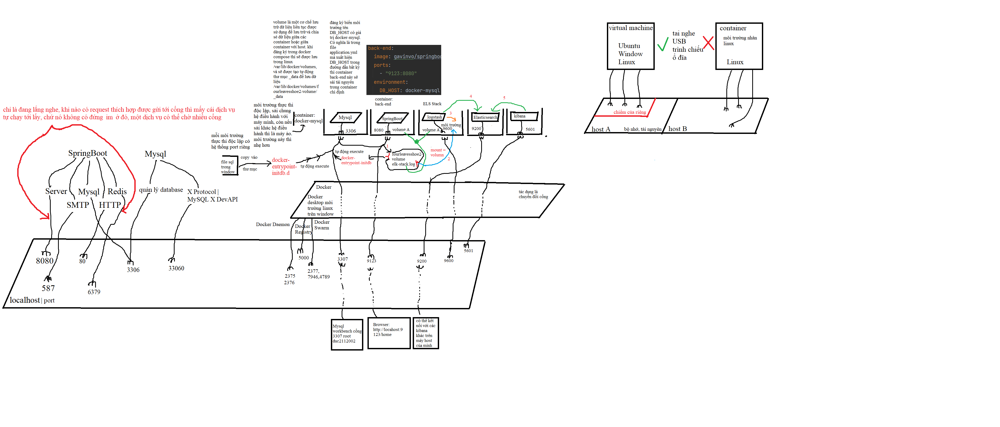

# Detailed explanations about Docker, Docker Compose files, and YAML.
According to the annotated diagram, Docker can be understood as a tool to run applications and software on independent Linux environments. Each application will run on a lightweight Linux environment (these are simplified versions of Linux that consume fewer resources).

When we install Docker Desktop, the following components are installed:

- Docker Engine: This is the core component of Docker, allowing you to create and manage containers.
- Docker CLI: A command-line tool to interact with Docker Engine.
- Docker Compose: A tool to define and run multi-container Docker applications.
- Docker Desktop GUI: A graphical interface that makes it easy to manage containers and images.
- Hyper-V or WSL 2: Docker Desktop uses one of these technologies to run Docker Engine on Windows. Hyper-V is a virtualization technology from Microsoft, while WSL 2 (Windows Subsystem for Linux 2) allows running a real Linux kernel on Windows.

An Image can be understood as source code, or source code along with a set of tools and a virtual machine packaged together. When you put an image into a Linux environment in Docker and run this image, that environment will become a container.

Volume: A mechanism to store data outside the container, ensuring data is not lost when the container is deleted or restarted. Volumes can be mounted to specific directories in the container.

When considering between containers, since they are Linux environments, they have the same directory structure. So when we mount a volume to a directory on one container, and then mount that volume to a similar directory on another container, we have access to the files in that directory from the container that was mounted with the volume previously.

Example:

- Container A mounts volume `/data` to the directory `/app/data`.
- Container B also mounts volume `/data` to the directory `/app/data`.
- As a result, both containers can read and write data to the directory `/app/data` and share data with each other.


# CI file
```ruby
name: Java CI with Maven 
// This sets the name of the workflow, which will appear in the GitHub Actions tab.
 
on:
  push:
    branches: [ "main" ]
  pull_request:
    branches: [ "main" ]
// Specifies the events that trigger the workflow. Here, the workflow runs on push and pull_request events to the main branch.


jobs:
  build-deploy:
    name: Build and Deploy Spring Boot
    // jobs: Defines a list of jobs to run. Each job runs in a fresh instance of the virtual environment.
    // build-deploy: The ID of the job.
    // name: A human-readable name for the job.
    
    services:
      mysql:
        image: mysql:8.0
        ports:
          - 3306:3306
        env:
            MYSQL_ROOT_PASSWORD: duc2112002
            MYSQL_DATABASE: fourleavesshoe2
        options: --health-cmd="mysqladmin ping" --health-interval=10s --health-timeout=5s --health-retries=3
      // services: Defines services that are required for the job. Here, a MySQL service is set up.
      // mysql: The ID of the service.
      // image: The Docker image to use for the service.
      // ports: Maps the container port to the host port.
      // env: Environment variables for the MySQL container.
      // options: Additional options for the service, such as health checks.
    
    runs-on: ubuntu-latest
    // runs-on: Specifies the type of runner (virtual machine) to use. Here, it uses the latest Ubuntu runner
    
    steps:
    // steps: A list of steps to run in the job.
    
    - name: Checkout code
      uses: actions/checkout@v3
    // name: A human-readable name for the step.
    // uses: Specifies an action to use. Here, it uses the actions/checkout action to check out the repository code.
    
    - name: Set up JDK 17
      uses: actions/setup-java@v3
      with:
        java-version: '17'
        distribution: 'temurin'
        cache: maven
        
    // Set up JDK 17: Sets up JDK 17 using the actions/setup-java action.
    // with: Specifies parameters for the action.
        // java-version: The version of Java to use.
        // distribution: The distribution of JDK to use (Temurin in this case).
        // cache: Enables caching for Maven dependencies.

        // actions/checkout: This is a GitHub Action used to checkout (retrieve the source code) of the repository into the working directory of the GitHub Actions runner. This allows other workflows to access and work with your source code.
        // actions/setup-java: This is a GitHub Action used to install and configure a specific version of Java on the GitHub Actions runner. It supports multiple versions and distributions of Java.
        // Java distributions are different versions of the Java Development Kit (JDK) provided by various vendors: các bản phân phối java
        
    - name: Test with Maven
      run: mvn -B test --file pom.xml
      // Test with Maven: Runs Maven tests, a name of job's step
      // Runs the Maven command mvn -B test --file pom.xml to execute the tests defined in the pom.xml file.
      
    - name: Build with Maven
      run: |
        mvn clean install
        mvn -B package --file pom.xml
        // run the maven command
        // clean: This command deletes the target directory 
        // install: This phase compiles the code, runs tests, and installs the resulting artifact (usually a JAR file) into the local Maven repository. 
        // However, the original artifact JAR just have the basic information without compiled code.
        // package:  This phase takes the compiled code and packages it into a distributable format, such as a JAR or WAR file.
        // maven downloaded dependency into maven local storage. 
        // When you run Maven commands in the YAML file of a GitHub workflow, the dependencies will be downloaded and stored in the ~/.m2/repository directory of the runner. 
        // Then, when you package your application into a Docker image, these dependencies will be included in the image. Runner is a host or an environment where executes workflows.
        // Github provides runners to execute workflows in Github Actions.
        
    - name: Login to DockerHub
      uses: docker/login-action@v3
      with:
        username: ${{ secrets.DOCKER_USERNAME }}
        password: ${{ secrets.DOCKER_PASSWORD }}

    - name: Build Docker Image
      uses: docker/build-push-action@v3
      with:
            context: .
            dockerfile: Dockerfile
            push: false
            tags: gavinvo/springboot_filtro:latest
      # This is an action named build-push-action at version 3. This action is used to build and optionally push the Docker image to a registry such as Docker Hub.
      # The runner will use the Dockerfile from the source code, which is obtained from the checkout@v3 action, to build the Docker image.
      # The JAR file is copied into the image, and the image is tagged as "gavinvo/springboot_filtro:latest".
      # Since 'push' is set to false, the image will not be pushed to a Docker registry.


    - name: Push Docker Image
      uses: docker/build-push-action@v3
      with:
            context: .
            dockerfile: Dockerfile
            push: true
            tags: gavinvo/springboot_filtro:latest


```
# Docker file
```ruby
FROM eclipse-temurin:17-jdk-alpine

WORKDIR /app

COPY target/filtro-0.0.1-SNAPSHOT.jar /app/fourleavesshoedocker.jar

EXPOSE 8080

CMD ["java","-jar","/app/fourleavesshoedocker.jar"]
```

# docker-compose.yml
```ruby

```

# elk-docker-compose.yml
```ruby

```

## Steps to Build and Run a Spring Boot Project
- ### Step 1: Maven Downloads Dependencies
Maven reads the pom.xml file to identify the necessary libraries and plugins.
Maven downloads the dependencies from the repository if they are not already available on your computer.

- ### Step 2: Compile Source Code
Maven uses the JDK to compile Java source code into bytecode.
The .java files in the src/main/java directory are compiled into .class files and stored in the target/classes directory.

- ### Step 3: Unit Testing
Maven runs the unit tests defined in the src/test/java directory.
If all tests pass, the build process continues. If any test fails, the build process stops and reports an error.

- ### Step 4: Package the Application
Maven packages the application into a jar or war file, depending on the configuration in pom.xml.
This jar or war file is stored in the target directory.

- ### Step 5: Run the Application (if configured)
If you have configured Maven to run the application after the build, Maven uses the JDK to start the Spring Boot application.
The application starts running on the configured port (default is 8080).

- ### Step 6: Deployment (if configured)
If you have configured Maven to deploy the application, Maven performs the deployment steps as per your configuration, such as pushing the application to a server or a cloud service.

## The purpose of the Maven, JDK, JRE, JVM; Plugin, Library, Dependency; Static code analysis; Virtual Machine, Container; Compilation (biên dịch) vs Interpretation (Thông dịch)?


